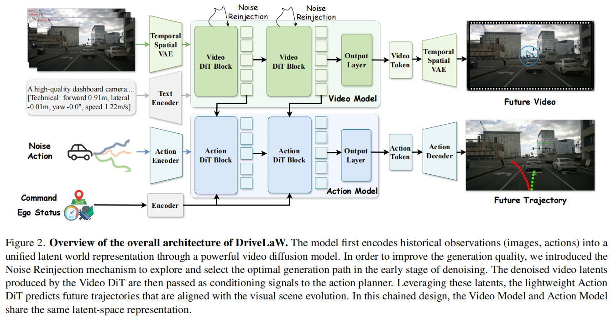

<div align="center">
<h2>DriveLaW: Unifying Planning and Video Generation in a Latent Driving World</h2>
<h2>CVPR 2026</h2>
Tianze Xia<sup>1,2*</sup>, Yongkang Li<sup>1,2*</sup>, Lijun Zhou<sup>2*</sup>, Jingfeng Yao<sup>1</sup>, Kaixin Xiong<sup>2</sup>, Haiyang Sun<sup>2†</sup>,  Bing Wang<sup>2</sup>,<br>Kun Ma<sup>2</sup>, Guang Chen<sup>2</sup>, Hangjun Ye<sup>2</sup>, Wenyu Liu<sup>1</sup>, Xinggang Wang<sup>1✉</sup>


<sup>1</sup>  Huazhong University of Science and Technology
<sup>2</sup>  Xiaomi EV 

(\*) Equal contribution. (†) Project leader. (✉)Corresponding Author.

<a href="https://arxiv.org/abs/2512.23421"></a>
<a href="https://wm-research.github.io/DriveLaW/"></a>
</div>

## News
`[2026/3/17]` Weights of DriveLaW-Video and DriveLaW-Act have been released.🚀

`[2026/3/16]` Codes of DriveLaW has been released.🚀

`[2026/2/21]` Our paper has been accepted at CVPR 2026. 🎉

`[2025/12/30]` [ArXiv](https://arxiv.org/abs/2512.23421) paper release. Models/Code are coming soon. Please stay tuned! ☕️

## Updates
- [x] Release Paper   
- [x] Release inference & training codes  
- [x] Release model weights 

<!-- ## Introduction -->
## Abstract
World models have become crucial for autonomous driving, as they learn how scenarios evolve over time to address the long-tail challenges of the real world. However, current approaches relegate world models to limited roles: they operate within ostensibly unified architectures that still keep world prediction and motion planning as decoupled processes. To bridge this gap, we propose DriveLaW, a novel paradigm that unifies video generation and motion planning. By directly injecting the latent representation from its video generator into the planner, DriveLaW ensures inherent consistency between high-fidelity future generation and reliable trajectory planning. Specifically, DriveLaW consists of two core components: DriveLaW-Video, our powerful world model that generates high-fidelity forecasting with expressive latent representations, and DriveLaW-Act, a diffusion planner that generates consistent and reliable trajectories from the latent of DriveLaW-Video, with both components optimized by a three-stage progressive training strategy. The power of our unified paradigm is demonstrated by new state-of-the-art results across both tasks. DriveLaW not only advances video prediction significantly, surpassing best-performing work by 33.3% in FID and 1.8% in FVD, but also achieves a new record on the NAVSIM planning benchmark.

## Overview
<div align="center">

</div>


## Getting Started

The codebase is organized into two main components:

- **DriveLaW-Video**: Video world model 
- **DriveLaW-Act**: Diffusion-based planner that consumes video latents from DriveLaW-Video

Basci installation for DriveLaW :

```bash
pip install -e .
git clone https://github.com/motional/nuplan-devkit.git
cd nuplan-devkit
pip install -e .
```

For a **video-only** world model :

- [DriveLaW-Video/Infer/README.md](DriveLaW-Video/Infer/README.md)
- [DriveLaW-Video/Train/README.md](DriveLaW-Video/Train/README.md)

For **planning / NavSim** evaluation :

- [DriveLaW-Act/README.md](DriveLaW-Act/README.md)

## Contact
If you have any questions, please contact Tianze Xia via email (xiatianze@hust.edu.cn).

## Acknowledgments
DriveLaW is inspired by the following outstanding contributions to the open-source community: [NAVSIM](https://github.com/autonomousvision/navsim), [LTX-Video](https://github.com/Lightricks/LTX-Video)
, [ReCogDrive](https://github.com/xiaomi-research/recogdrive/tree/main), [Diffusers](https://github.com/huggingface/diffusers), [Genie Envisioner](https://github.com/AgibotTech/Genie-Envisioner/tree/master), [Epona](https://github.com/Kevin-thu/Epona/tree/main).

## Citation
If you find DriveLaW is useful in your research or applications, please consider giving us a star 🌟 and citing it by the following BibTeX entry.

```bibtex
@article{xia2025drivelaw,
  title={DriveLaW: Unifying Planning and Video Generation in a Latent Driving World},
  author={Xia, Tianze and Li, Yongkang and Zhou, Lijun and Yao, Jingfeng and Xiong, Kaixin and Sun, Haiyang and Wang, Bing and Ma, Kun and Ye, Hangjun and Liu, Wenyu and others},
  journal={arXiv preprint arXiv:2512.23421},
  year={2025}
}
```